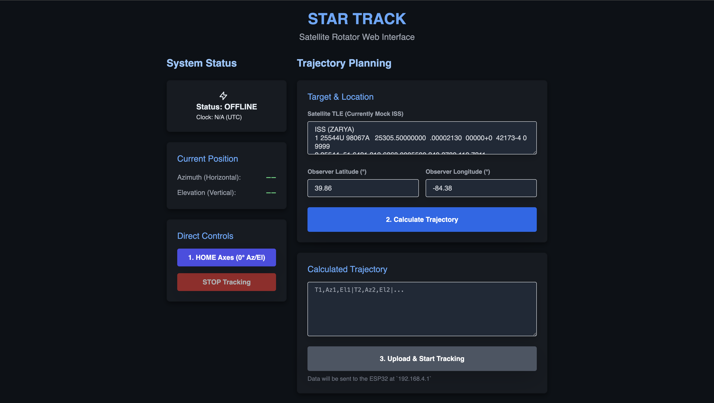

# Star Track Project: Satellite Tracking Antenna



## Phase 1: Planning and System Design (Steps 1 & 2)

This phase defines the system architecture, chooses the core components, and finalizes the requirements for the hardware and software.

### 1.1 System Architecture Overview

The system will use a three-tier architecture:

*   **Presentation/Calculation Layer (Flask Web App):** Handles TLE data, orbital mechanics calculations, user interface, satellite selection, and scheduling.
*   **Communication Layer (Wi-Fi Module):** Provides a wireless link between the Flask app (local network) and the microcontroller.
*   **Control Layer (Arduino Uno):** Receives target Azimuth and Elevation coordinates, drives the stepper motors, and executes the tracking sequence.

### 1.2 Component Selection (Refined)

This list details the specific components recommended to meet the precision and control requirements.

| Component                         | Purpose                                     | Selection                               | Key Specifications / Rationale                                                                                                                               |
| --------------------------------- | ------------------------------------------- | --------------------------------------- | ------------------------------------------------------------------------------------------------------------------------------------------------------------ |
| **Microcontroller (Primary)**     | Motor control and interface                 | *Arduino Uno*                           | Confirmed by user. Will be responsible for Step/Dir motor signals.                                                                                           |
| **Microcontroller (Secondary/Comm)** | Wi-Fi communication, time sync, data relay  | *ESP32* (NodeMCU or similar dev board)  | Confirmed: Excellent choice for robust Wi-Fi and data handling. Communicates with Uno via Serial (UART).                                                   |
| **Motors (2x) - Azimuth & Elevation** | Precise, geared rotation                    | *NEMA 17 Stepper Motors* (e.g., 42BYGHW609) | Must be sized to handle up to $\approx 2.1\text{kg}$ ($4.6\text{lbs}$) payload weight (worst-case estimate). High-torque models are required.                   |
| **Motor Drivers (2x)**            | Driving the steppers                        | *DRV8825 Module* (e.g., HiLetgo)        | Confirmed: Supports $1/32$ microstepping for high resolution and smooth motion. Must be current-limited to protect the motors.                               |
| **Power Supply**                  | Powering motors and electronics             | *12V DC, 5A Adapter* (Confirmed)        | Robust power source for the motors. A high-quality $5\text{V}$ regulator will be needed for the ESP32 and Arduino logic if the Uno's barrel jack isn't used. |
| **Antenna**                       | Tracking target                             | *Lightweight Yagi Antenna*              | Design constraint: Max estimated weight of $\approx 2.1\text{kg}$ ($4.6\text{lbs}$).                                                                          |
| **Mounting**                      | Structural stability                        | *Tripod with Custom 2-Axis Mount*       | The design must incorporate gear reduction for both axes (see 1.2.1).                                                                                        |

#### 1.2.1 Critical Mechanical Drive System Design

The raw torque of a *NEMA 17* motor is insufficient to move a yagi antenna with enough precision. Gear reduction is **mandatory** on both axes.

*   **Antenna Weight Assumption:** Planning for a worst-case payload of $2.1\text{kg}$ ($4.6\text{lbs}$). This will influence the torque calculation.
*   **Dual-Path Design Approach:** We will track two gear system options for the build instructions to balance precision and cost:
    *   **High-Precision/High-Cost (Worm Gear Drive):** Offers high ratio, self-locking capability, and near-zero backlash, making it superior for maintaining position in wind.
    *   **Budget/Medium-Precision (High-Ratio Belt Drive):** More cost-effective and easier to 3D print or source, but may require slightly more complex software damping to manage potential backlash.
*   **Impact of Gearing on Precision (Example using $100:1$ ratio):**
    If we use a $100:1$ gear ratio and the *DRV8825* driver on $1/32$ microstepping:
    $$\text{Angular Resolution} = \frac{\text{Step Angle}}{\text{Gear Ratio} \times \text{Microsteps}} = \frac{1.8^\circ}{100 \times 32} \approx 0.00056^\circ$$
    This level of precision is more than adequate for LEO (Low Earth Orbit) satellite tracking, which typically requires accuracy better than $\pm 1^\circ$.

### 1.3 Orbital Mechanics & Data Flow Definition

*   **Data Source:** Two-Line Element (TLE) data for satellites (e.g., from Celestrak).
*   **Calculation Engine:** Python library (*pyorbital* or *skyfield* for superior accuracy) within the Flask app to predict Azimuth/Elevation angles for a given TLE and time/location.
*   **Output Data:** The Flask app will transmit time-stamped Az/El coordinate pairs (e.g., `"Time, Azimuth, Elevation"`) to the Arduino over Wi-Fi.

## Phase 2: Hardware Build and Mechanical Integration (Steps 3 & 4)

... (Remaining sections unchanged)

## Phase 3: Software Development and Integration (Step 4)

### 3.1 Communication and Control Protocol Refined (Addressing User Questions)

To ensure reliable, synchronized, two-way communication, we will use a Hybrid Serial/HTTP Protocol facilitated by the *ESP32*.

#### 3.1.1 Data Format and Custom Library (Q1 Answer)

*   **Communication Format (Flask $\rightarrow$ ESP32):**
    We will use a simple, efficient Custom Delimiter-Separated Value (DSV) string format for the trajectory data, as it's lightweight and fast for the Arduino to parse.

*   **Trajectory Packet Example (Sent from Flask):** A series of comma-separated tracking points, each separated by a pipe (`|`).
    ```
    <Timestamp1>,<Azimuth1>,<Elevation1>|<Timestamp2>,<Azimuth2>,<Elevation2>|...
    ```
    The timestamp must be in a standard format (e.g., Unix Epoch Time).

*   **Microcontroller Logic:**
    Yes, custom C/C++ classes/libraries will be written for:
    *   `WiFiComm` (on *ESP32*): Handles HTTP client/server tasks and relays data to the Uno via Hardware Serial.
    *   `TrackingEngine` (on *Arduino Uno*): Handles parsing the incoming DSV string, managing the internal clock, and executing precise motor movements.
    *   `StepperControl` (on *Arduino Uno*): Abstracts the *DRV8825* driver logic (microstepping, direction, pulse generation).

#### 3.1.2 State Synchronization and Two-Way Communication (Q2 Answer)

The Flask app will poll the *ESP32* for status, establishing a reliable two-way flow without complex WebSockets.

*   **Flask $\rightarrow$ ESP32 (Command/Data):** Simple HTTP `POST` requests.
    *   `/upload_trajectory`: Flask posts the entire tracking DSV string batch.
    *   `/command`: Flask posts simple JSON commands.
        ```json
        {"cmd": "STOP"}
        {"cmd": "HOME"}
        ```

*   **ESP32 $\rightarrow$ Flask (Status):** Flask polls the *ESP32*'s internal web server via a simple HTTP `GET` request.
    *   **Endpoint:** `/status`
    *   **Response (JSON):** A lightweight JSON object containing the current operational state:
        ```json
        {
          "status": "TRACKING",
          "az": 120.5,
          "el": 35.1,
          "target": 121.0,
          "time": 1678886400
        }
        ```

*   **States:** We will define four primary states: `IDLE`, `RECEIVING_DATA`, `TRACKING`, and `ERROR`. The Flask app will use this state to enable/disable UI buttons (e.g., disabling new trajectory uploads while the state is `TRACKING`).

#### 3.1.3 Time Synchronization (Q3 Answer)

The *ESP32* will serve as the system's authoritative clock.

*   **NTP Integration (on ESP32):** The *ESP32* will connect to an NTP server (Network Time Protocol) over Wi-Fi to get accurate UTC time (Unix Epoch). This is highly reliable and precise enough for satellite tracking.
*   **Time Relay (ESP32 $\rightarrow$ Uno):**
    *   The *ESP32* will send the current UTC timestamp to the *Arduino Uno* whenever a new trajectory is uploaded, and periodically (e.g., every 5 minutes) to correct drift.
    *   The *Arduino Uno*'s `TrackingEngine` will start its timing and execute the trajectory points based on this initial received UTC timestamp.

### 3.2 Flask Web Application (Update)

*   **UI:** Develop a responsive interface to select the current location (GPS coordinates), input TLE data, select a satellite, and define the start/end time for tracking.
*   **Orbital Calculation Logic:** Implement the Python code (*skyfield* recommended) to perform the SGP4 calculation and generate the DSV track points.
*   **Communication Endpoint:** Create logic for posting the DSV data to the *ESP32*'s `/upload_trajectory` endpoint and polling the `/status` endpoint.

### 3.3 Arduino Firmware (Uno + ESP Module) (Update)

*   **Wi-Fi Listener (ESP32):** Program the *ESP32* to connect to the local Wi-Fi router, implement the NTP synchronization, host the simple `/status` server, and act as a client for Flask commands.
*   **Serial Interface:** Code the *ESP32* to efficiently relay the DSV trajectory string and time data to the Uno via UART.
*   **Command Parsing (Uno):** Develop code on the Arduino to receive, parse the DSV string into a motor buffer (using the custom `TrackingEngine`), and execute the tracking routine precisely against the synchronized time.

## Phase 4: Testing, Calibration, and Reporting (Steps 5, 6, & 7)
The final stages involve rigorous testing and documentation.
4.1 Unit Testing
Test the Flask SGP4 calculator against known satellite paths.
Test the Arduino's stepper control for movement accuracy (degrees moved vs. commanded degrees).
Test the Wi-Fi connection and data transfer reliability.
4.2 System Integration and Field Test
Perform a full end-to-end test: Flask calculates, sends data, Arduino tracks.
Field Calibration: Calibrate the system in the field, aligning it to True North and adjusting for any mechanical offsets or errors in the Az/El calculation.
4.3 Documentation and Final Report
Finalize the Build Instructions (Step 6) including parts lists, assembly diagrams, and wiring schematics.
Prepare the Final Report (Step 7) detailing the design choices, test results (accuracy), and potential improvements.

[Build Plans](BUILDPLANS.md)

