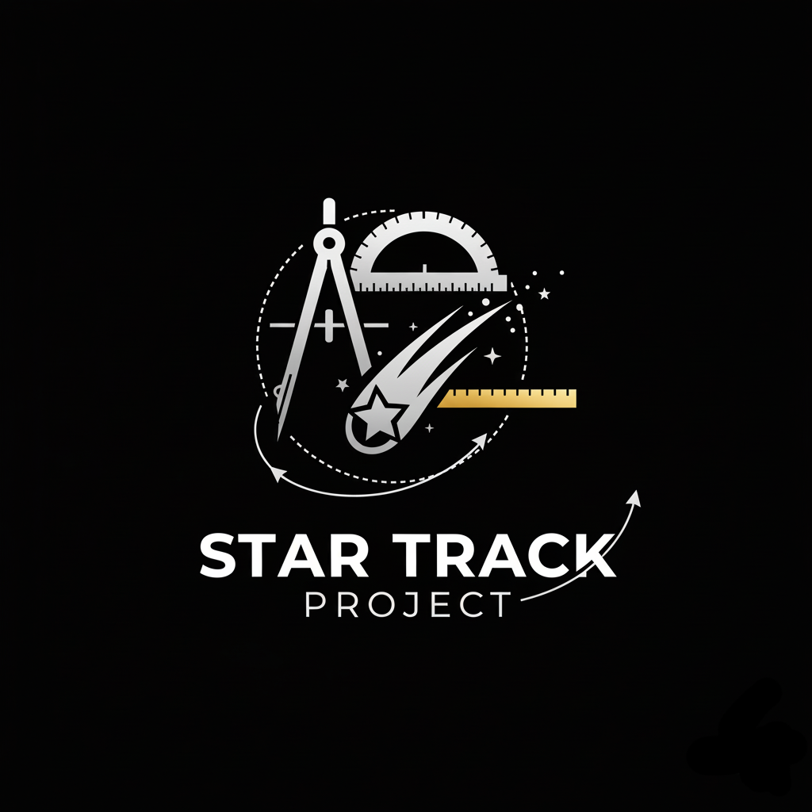

# Star Track Project: Satellite Tracking Antenna



# A hot mess in the works.  Stand by.
```markdown
<!--
## Phase 1: Planning and System Design (Steps 1 & 2)

This phase defines the system architecture, chooses the core components, and the hardware and software.

### 1.1 System Architecture Overview

The system will use a three-tier architecture:

*   **Presentation/Calculation Layer (Raspberry Pi):** Flask Web App handles TLE data, orbital mechanics (Skyfield), and GPS location.
*   **Communication Layer (USB Serial):** Direct USB connection between Pi and Arduino.
*   **Control Layer (Arduino Uno):** Receives target Azimuth and Elevation coordinates, drives the stepper motors (NEMA 23), and executes the tracking sequence.

### 1.2 Component Selection (Refined)

This list details the specific components recommended to meet the precision and control requirements.

| Component                         | Purpose                                     | Selection                               | Key Specifications / Rationale                                                                                                                               |
| --------------------------------- | ------------------------------------------- | --------------------------------------- | ------------------------------------------------------------------------------------------------------------------------------------------------------------ |
| **Microcontroller (Primary)**     | Motor control and interface                 | *Arduino Uno*                           | Responsible for Step/Dir motor signals. Connected to Pi via USB.                                                                                           |
| **Host Computer**                 | Web App, Calcs, GPS Interface               | *Raspberry Pi*                          | Runs the Flask App, talks to GPS and Arduino.                                                   |
| **Motors (2x) - Azimuth & Elevation** | Precise, geared rotation                    | *NEMA 23 Stepper Motors*                | Upgraded for higher torque to handle Yagi payload.                   |
| **Motor Drivers (2x)**            | Driving the steppers                        | *DRV8825 or DM542T*                     | Must be current-limited to protect the motors.                               |
| **Power Supply**                  | Powering motors                             | *12V/24V DC Supply*                     | Robust power source for the motors. Pi powered via USB-C. |
| **Antenna**                       | Tracking target                             | *Lightweight Yagi Antenna*              | Design constraint: Max estimated weight of approx 2.1kg (4.6lbs).                                                                          |
| **Mounting**                      | Structural stability                        | *Tripod with Custom 2-Axis Mount*       | The design must incorporate gear reduction for both axes (see 1.2.1).                                                                                        |

### 3.1 Communication and Control Protocol (Updated for Pi)

The Raspberry Pi communicates directly with the Arduino via USB Serial.

#### 3.1.1 Serial Protocol

*   **Format:** `CMD:<COMMAND>` or `DATA:<DSV_STRING>`
*   **Trajectory Data:** Same DSV format (`time,az,el|time,az,el...`) sent via `DATA:` command.
*   **Time Sync:** Pi sends `TIME:<epoch>` to synchronize the Arduino's internal clock.

### 3.2 Flask Web Application (Pi Version)

*   **GPS Integration:** Automatically reads `latitude` and `longitude` from a connected USB GPS module.
*   **Direct Serial:** No longer relies on HTTP/ESP32. Uses `pyserial` to push data to the Arduino.

### 3.3 Arduino Firmware

*   **TrackingEngine:** Optimised for NEMA 23 motors.
*   **Input:** Listens on Hardware Serial (USB) for commands from the Pi.

## Phase 4: Testing

4.1 Unit Testing
Test the Flask SGP4 calculator against known satellite paths.
Test the Arduino's stepper control for movement accuracy.
4.2 System Integration
Connect Pi, Arduino, and GPS. Verify "Calculate & Track" moves the motors.
4.3 Field Test
Calibrate to True North using the limit switches.

-->


[Build Plans](BUILDPLANS.md)

